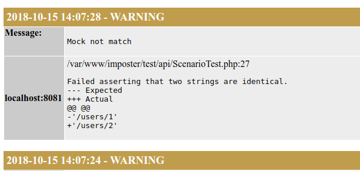

[](https://travis-ci.com/Kirouane/imposter.svg?branch=master)
[](https://coveralls.io/github/Kirouane/imposter?branch=master)

Imposter
======

Imposter is a php library that used to serve http stubs and mocks.

Here is an example to emphasize how is simple to mock an HTTP endpoint with this library in PHPUnit.

```php

/**
 * Class ScenarioTest
 * @package Imposter
 */
class ScenarioTest extends TestCase
{
    use PhpunitTrait;

    /**
     * @test
     */
    public function match()
    {
        $this
            ->openImposter(8081)
            ->withPath('/users/1')
            ->withMethod('POST')
            ->returnBody('{"response" :"okay"}')
            ->once()
            ->send();

        $client   = new \GuzzleHttp\Client();
        $response = $client->post('http://localhost:8081/users/1')->getBody()->getContents();
        self::assertSame($response, '{"response" :"okay"}');
        $this->closeImposers();
    }
}
```

Install
==

`composer require kirouane/imposter --dev`

Features
==

## Display logs

In case of the HTTP request doesn't match any mock, you can find out the reason here [http://localhost:2424/mock/log/html](http://localhost:2424/mock/log/html)

Below, you can see what the logs page looks like.

 

## PHPUnit Asserter

Imposter Library uses PHPunit asserters to match HTTP requests with the mocks you create.

Example :

```php

/**
 * Class ScenarioTest
 * @package Imposter
 */
class ScenarioTest extends TestCase
{
    use PhpunitTrait;

    /**
     * @test
     */
    public function match()
    {
        $this
            ->openImposter(8081)
            ->withPath('/users/1')
            ->withMethod($this->predicateImposter()->regExp('/GET|PUT|POST/'))
            ->withBody($this->predicateImposter()->jsonMatch('{"test":"[a-z]{4}"}'))
            ->returnBody('{"response" :"okay"}')
            ->once()
            ->send();

        $client   = new \GuzzleHttp\Client();
        $response = $client->post('http://localhost:8081/users/1', ['body' => '{"test":"abcd"}'])->getBody()->getContents();
        self::assertSame($response, '{"response" :"okay"}');
        $this->closeImposers();
    }
}
```


## Proxies

Not implemented yet